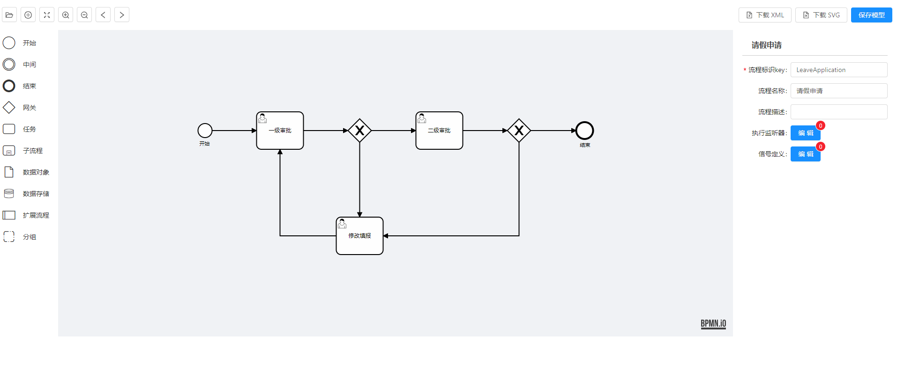
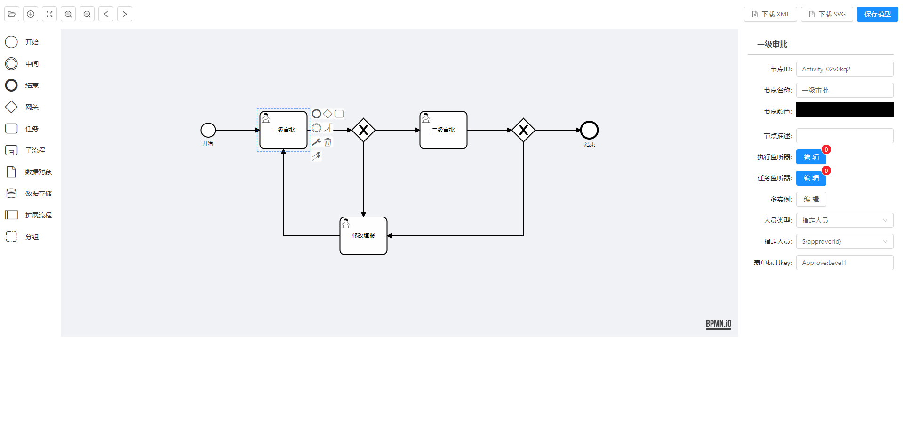
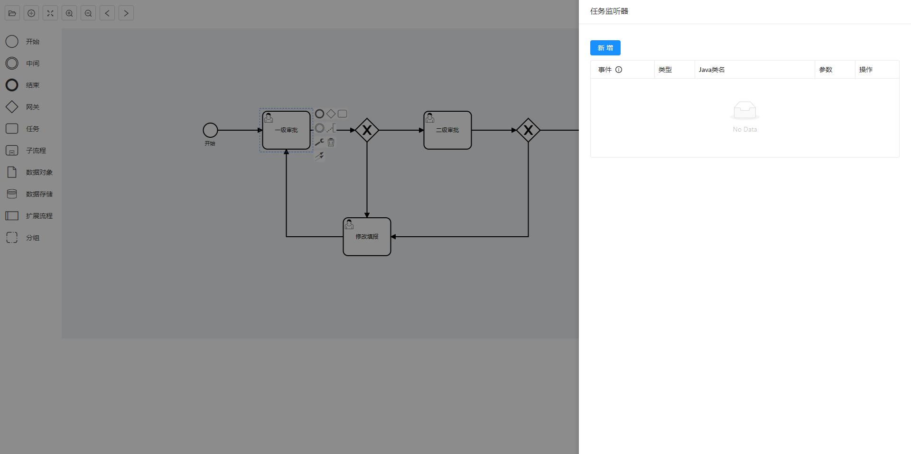

# Flowable-bpmn-modeler

🔥 本项目基于 `vue` `ant design vue` 和 `bpmn.io@7.0` ，实现 flowable 的 modeler 流程设计器

基于 [workflow-bpmn-modeler](https://github.com/GoldSubmarine/workflow-bpmn-modeler) 修改而来，原版采用 Vue element UI开发，有需要的可以链接直达，支持大佬！
## 预览






## 在线 demo

👉 https://bzw1204.github.io/flowable-bpmn-modeler/demo/


## 安装

```bash
# 安装
yarn add flowable-bpmn-modeler
```

## 使用说明（最简 demo）

```vue
<template>
  <div>
    <bpmn-modeler
      ref="refNode"
      :xml="xml"
      :users="users"
      :groups="groups"
      :is-view="false"
      @save="save"
    />
  </div>
</template>

<script>
import bpmnModeler from "workflow-bpmn-modeler";

export default {
  components: {
    bpmnModeler,
  },
  data() {
    return {
      xml: "", // 后端查询到的xml
      users: [
        { name: "张三", id: "zhangsan" },
        { name: "李四", id: "lisi" },
        { name: "王五", id: "wangwu" },
      ],
      groups: [
        { name: "web组", id: "web" },
        { name: "java组", id: "java" },
        { name: "python组", id: "python" },
      ],
      categorys: [
        { name: "OA", id: "oa" },
        { name: "财务", id: "finance" },
      ],
    };
  },
  methods: {
    getModelDetail() {
      // 发送请求，获取xml
      // this.xml = response.xml
    },
    save(data) {
      console.log(data);  // { process: {...}, xml: '...', svg: '...' }
    },
  },
};
</script>
```
## 关于定制

本组件对标的是 flowable 官方设计器，也就是实现 flowable 的 xml 规则标准，里面所用名词也都是官方文档中的专业术语。所以这个组件只是程序员在开发阶段，自己建模导出 xml 的工具，试图定制该建模器的行为都是不对的，不要把业务带到建模器中来！自己的业务应该另行开发增删改查来实现。

该组件未来也不会升级 UI 库和 vue。不管库是否兼容，通过 iframe 的方式集成建模器才是最简单正确的方式。

## License

[MIT](http://opensource.org/licenses/MIT)

Copyright (c) 2020-present, charles
